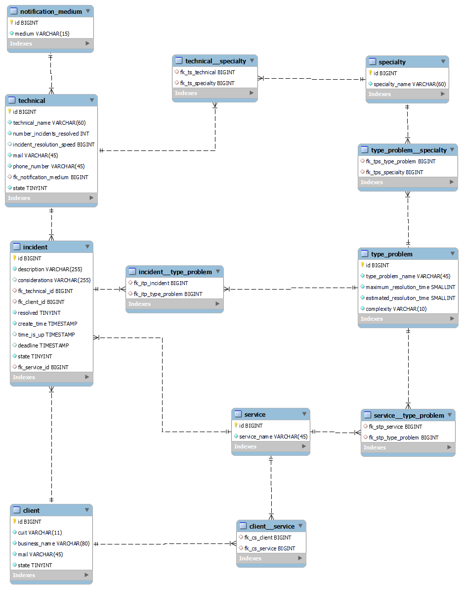

# Trabajo Práctico Integrador

## Sistema de Reporte de Inidentes

### Descripción del Proyecto

El proyecto consiste en el diseño y desarrollo de un sistema integral para la gestión en el diseño y desarrollo de un sistema integral para la gestión de incidentes en una empresa de soporte operativo. El sistema permitirá la generación y seguimiento de incidentes, así como la administración de técnicos, clientes y reportes asociados.

### Stack

- **Java**
- **MySql**

Diagrama de la base datos solución

### Funcionalidades Principales

#### Ciclo de Vida de un Incidente

1. **Registro de Cliente y Servicios:**

   - La mesa de ayuda ingresa los datos del cliente al recibir una llamada.
   - Se visualizan los servicios contratados por el cliente.

2. **Reporte de Incidentes:**

   - El operador solicita detalles del incidente, incluida la descripción y el tipo del problema.
   - El sistema presenta una lista de técnicos disponibles para resolver el problema.
   - El operador selecciona un técnico y el sistema estima el tiempo de resolución.
   - Se informa al cliente sobre la entrada del incidente y la fecha estimada de resolución.

3. **Asignación y Notificación:**

   - El sistema asigna el incidente al técnico seleccionado.
   - Se notifica al técnico sobre el nuevo incidente.

4. **Resolución del Incidente:**
   - El técnico marca el incidente como "resuelto" con consideraciones.
   - Se envía un email al cliente informando que el incidente está solucionado.

#### Otras Funcionalidades

- **Reportes de RRHH:**

  - Generación diaria de reportes con incidentes asignados a cada técnico y su estado.

- **Colchón de Horas:**

  - El operador puede agregar un colchón de horas estimadas para problemas considerados "complejos".

- **Incidentes con Conjunto de Problemas:**

  - Posibilidad de dar de alta incidentes con un conjunto de problemas relacionados.

- **Informes Específicos:**
  - Identificación del técnico con más incidentes resueltos en los últimos N días.
  - Identificación del técnico con más incidentes resueltos de una especialidad específica en los últimos N días.
  - Identificación del técnico que más rápido resolvió los incidentes.

### Consideraciones Técnicas

- Cada tipo de problema puede ser solucionado por una o varias especialidades.
- Los operadores pueden definir su tiempo estimado de resolución por defecto por tipo de problema.
- Cada técnico puede definir su medio preferido de notificación (Email o WhatsApp).

**Nota:** No se han definido las bibliotecas específicas para las notificaciones.

### Ejecución del Proyecto

1. Clonar el repositorio desde [TP Incident Reporting System](https://github.com/Martiks38/tp-incident-reporting-system.git)
2. Ejecutar script sql en la carpeta db.
3. Cambiar el nombre de usuario y contraseña de la base de datos respecto a las de su base de datos en reporting-incident-system/src/main/resources/META-INF/persistence.xml
4. Ejecutar el código
